## Canvas Basico

## Distintos Estilos Canva

#### Figura 1

#### Figura 2

#### Figura 3

#### Figura 4

#### Figura 5

#### Figura 6
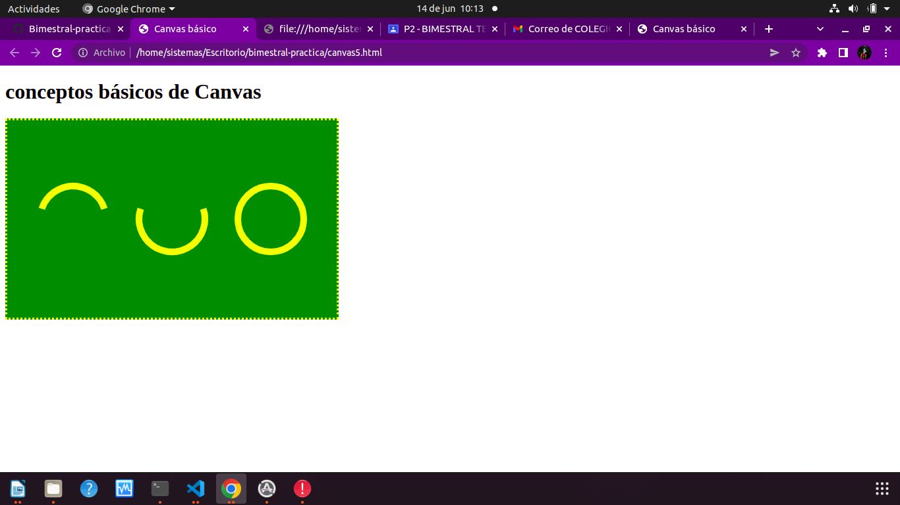

#### Figura 7

#### Figura 8

#### Figura 9
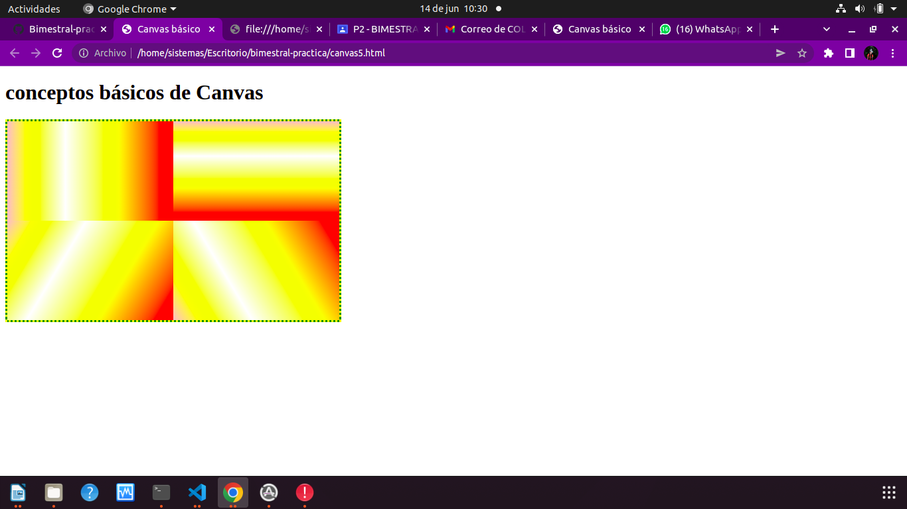

#### Figura 10
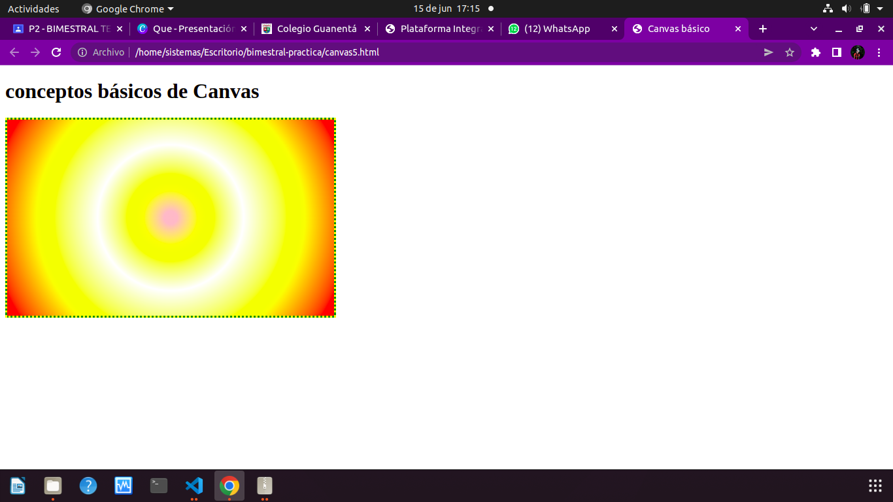

#### Figura 11
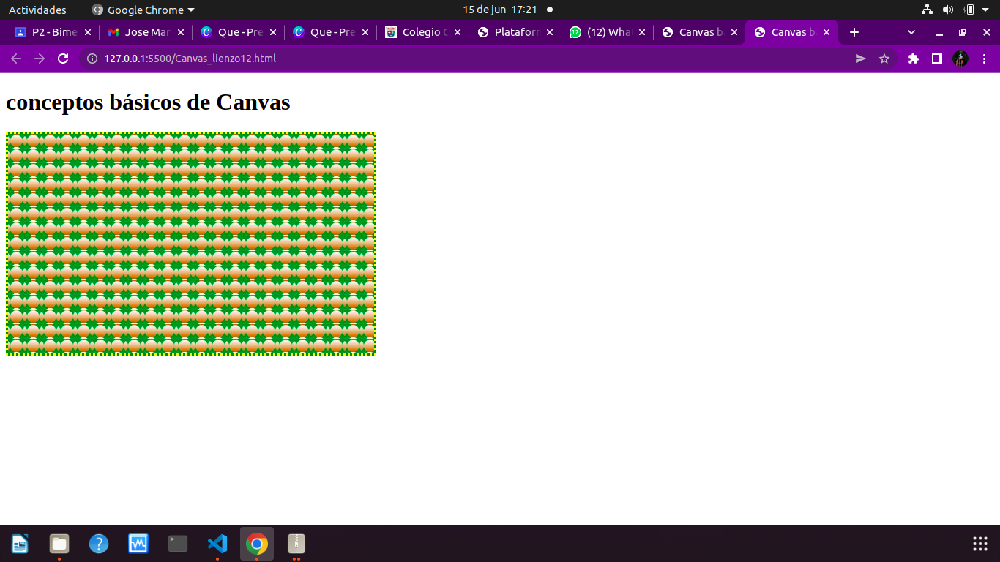

#### Figura 12
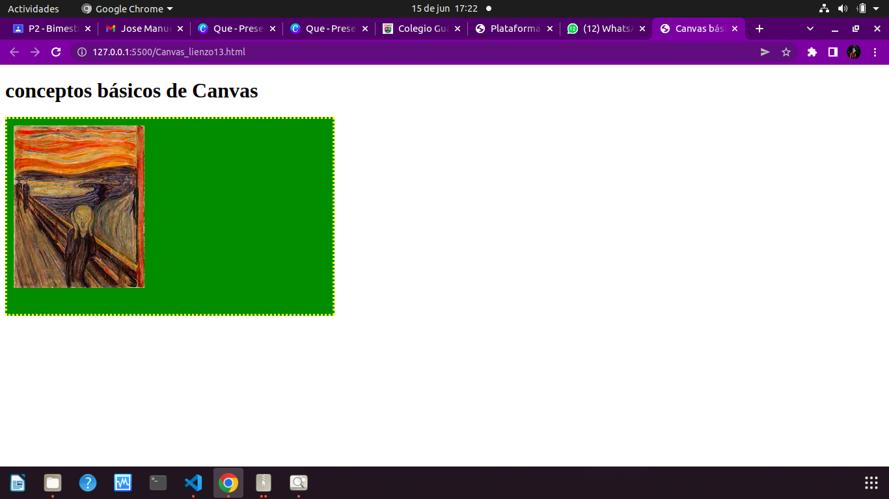

#### Figura 13
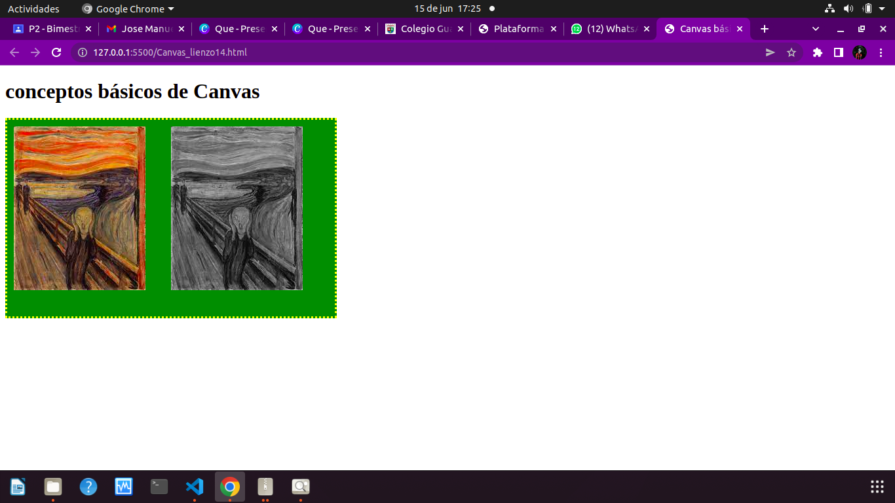

#### Figura 14
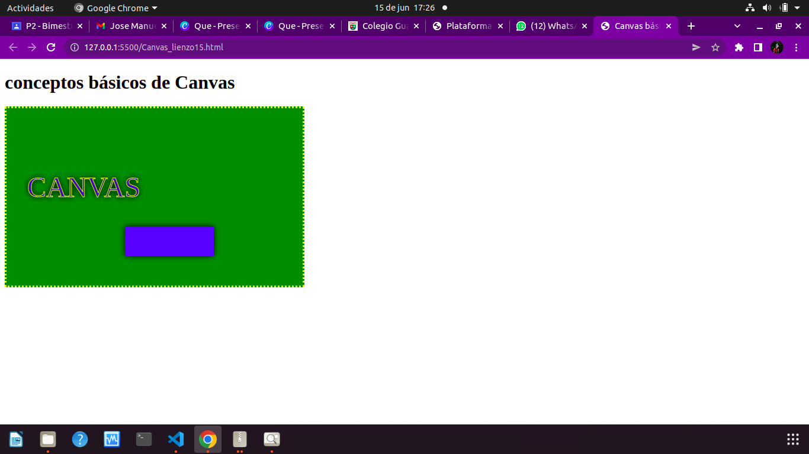

#### Figura 15
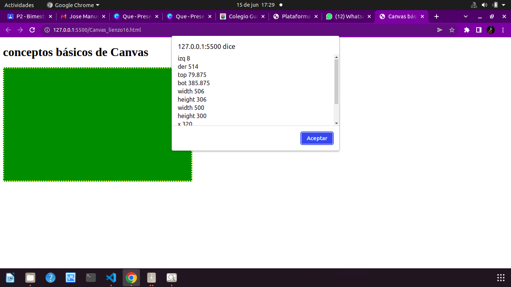

#### Animación 1
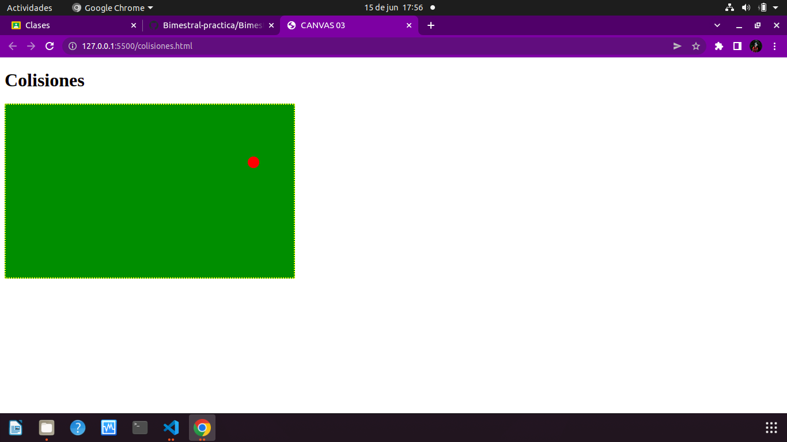

#### Animación 2
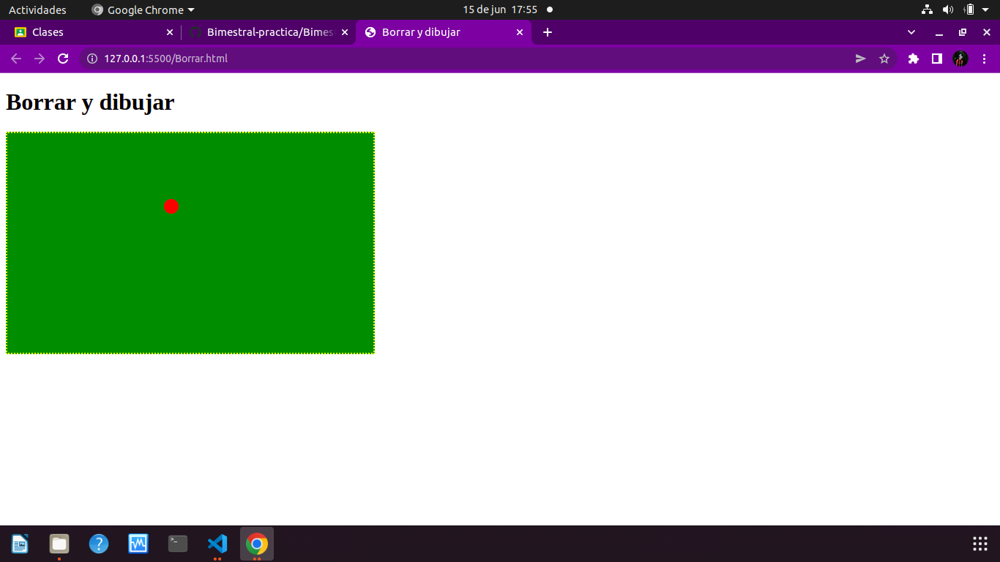

#### Animación 3
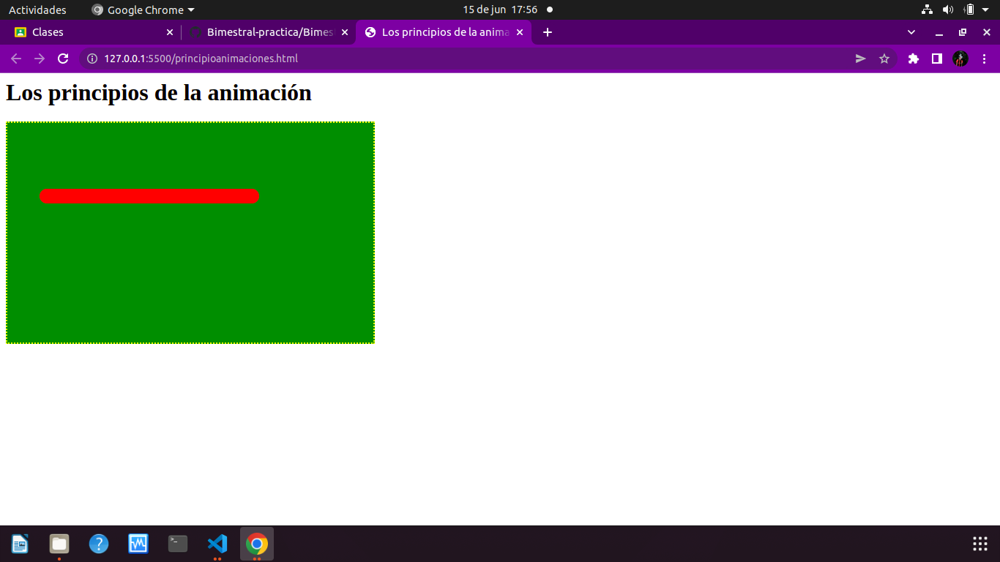

#### Animación 4
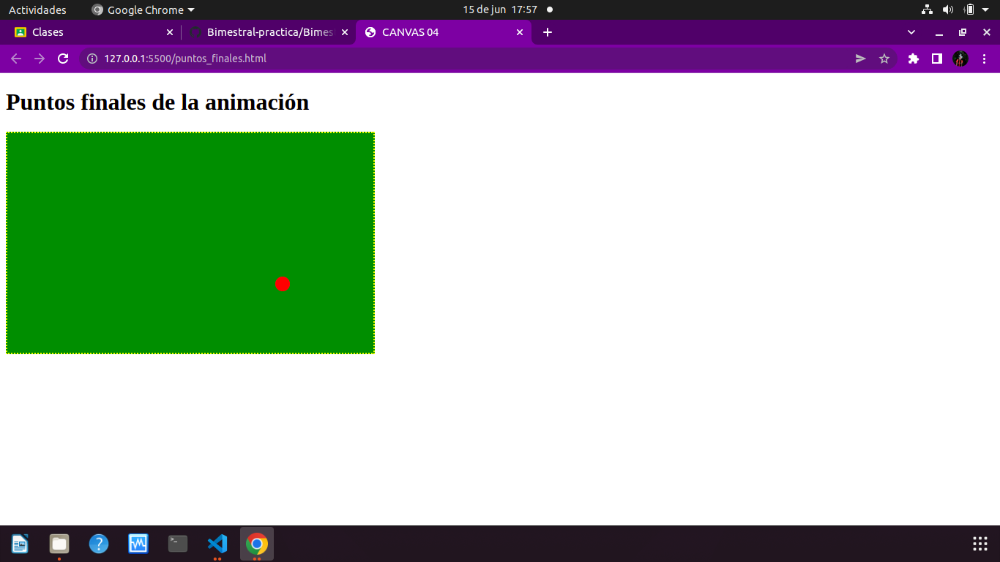

#### basico 1

#### basico 1.1
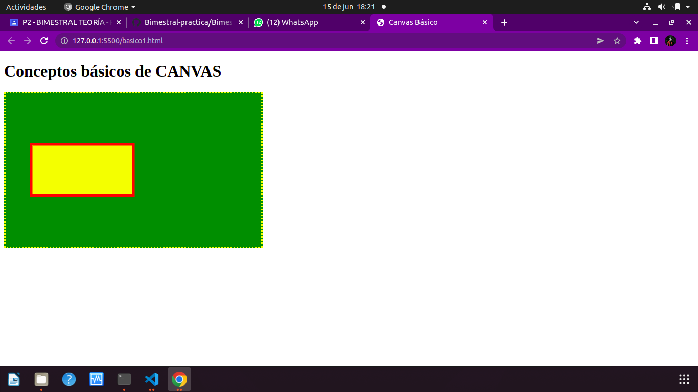

